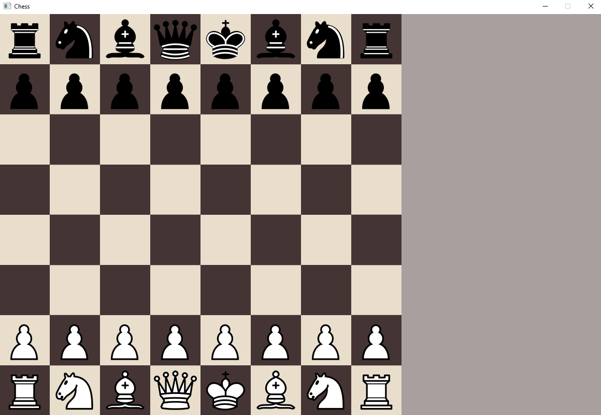
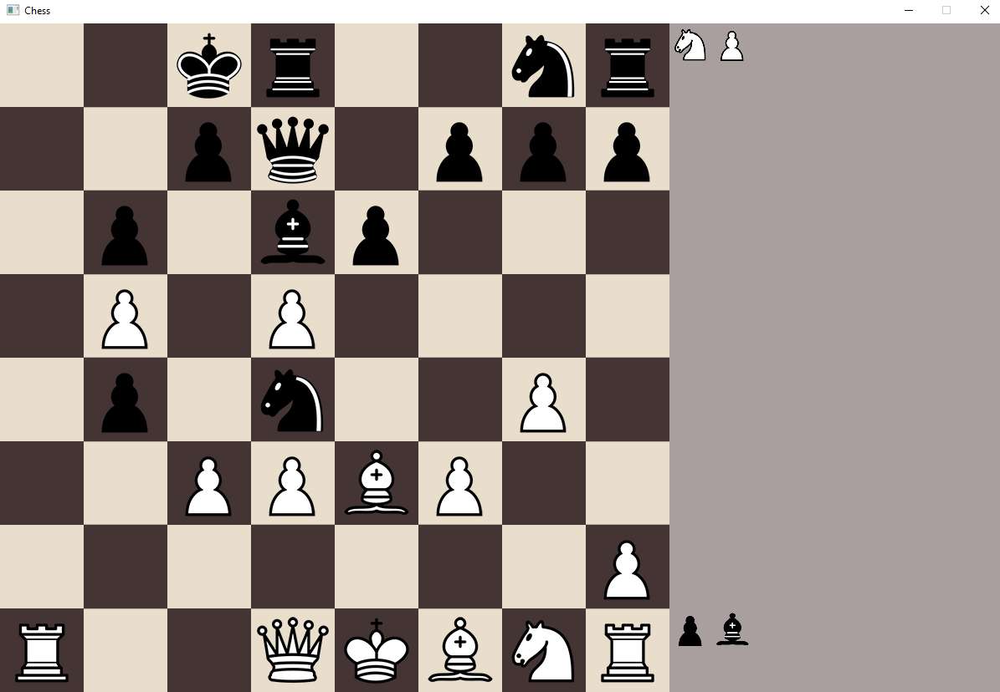
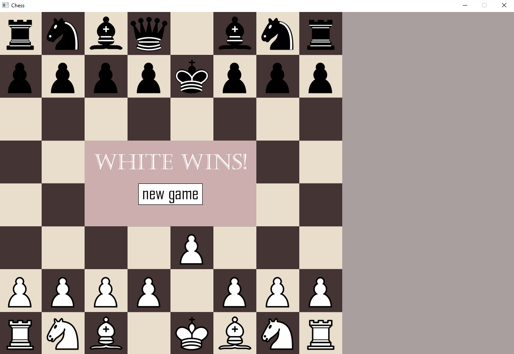
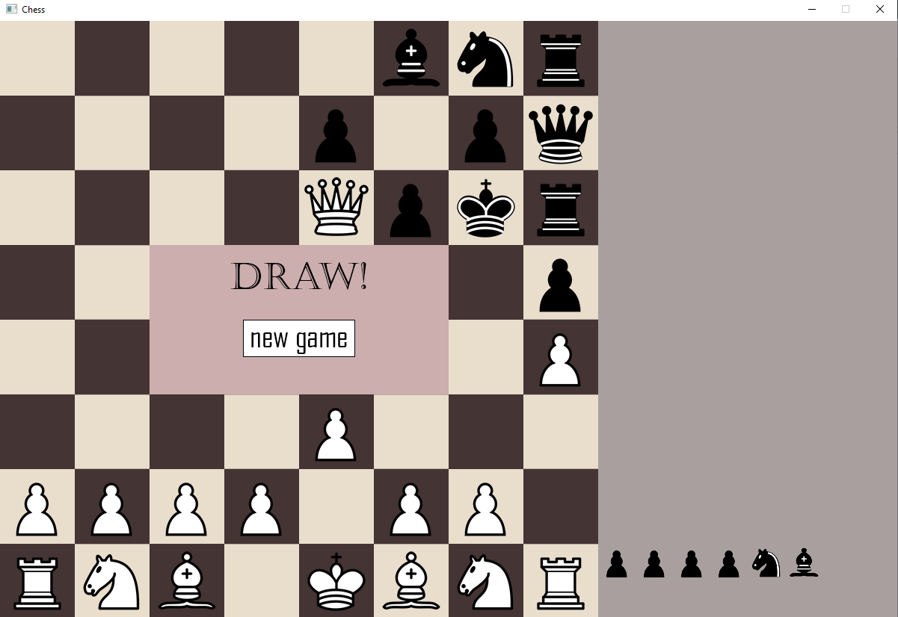
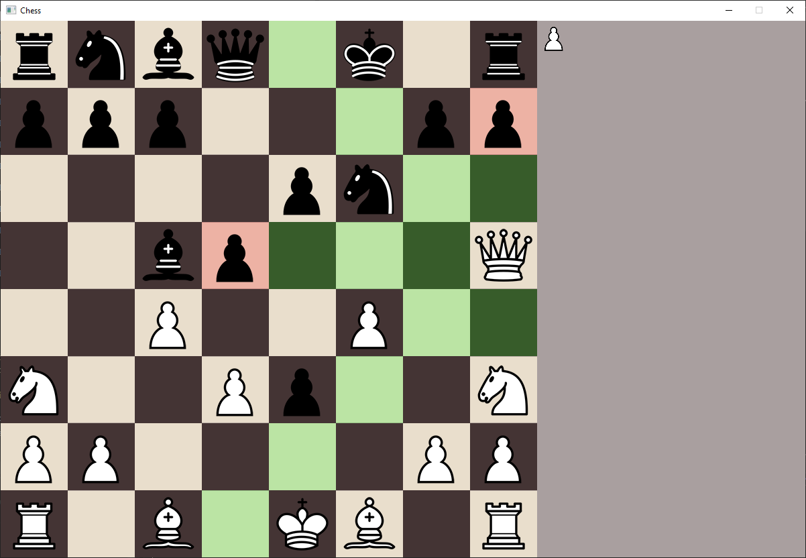
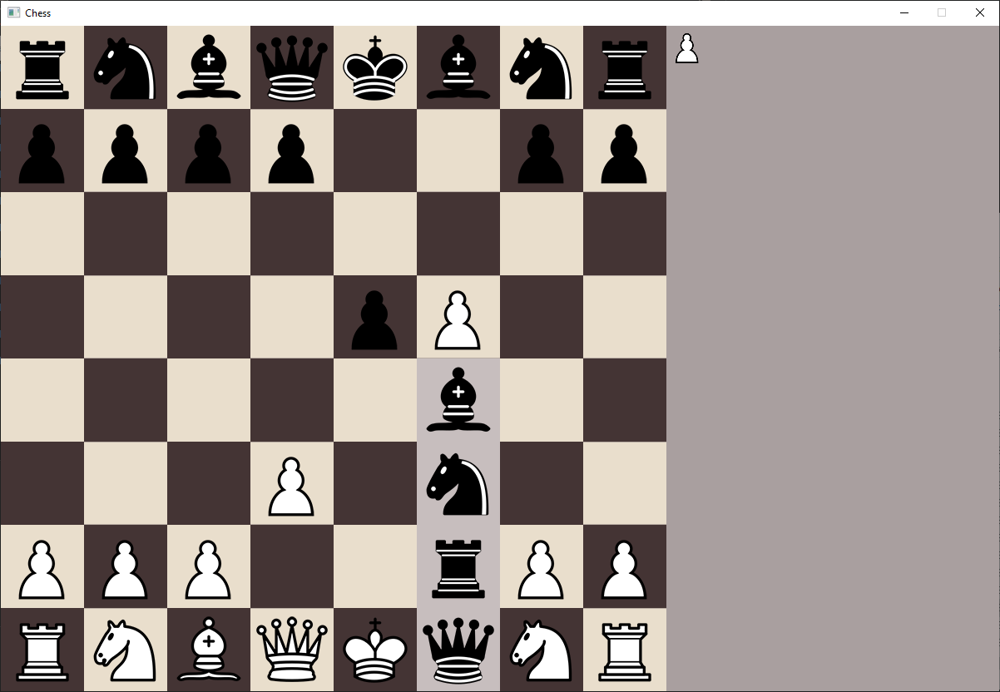

# Overall
## Description
This is my first ambitious game project using C++ and the SFML library.
In the code I've used classes to represent different parts of the application.
The chess contains all rules that are required for the average playing experience :
- Performing only legal moves
- Capturing when possible 
- Castling
- Pawn promotion
- Stalemate
- Checkmate

## How to launch?
In order to play or test the game on your machine, download the contents of the "ForDistribution" directory. Make sure to place them in one directory and just launch the ChessGame.exe file. 

# Environment
The project was solely created in MS Visual Studio 2022 using C++ 17 and the SFML library.

# Assets
The chess pieces and sounds were downloaded from the web.
Other assets were created by me using Adobe Photoshop.

# Additional features
- Endgame screen stating the winner with a possibility to start a new game with a press of the button
- Ability to revert moves by pressing **R**
- Show possible moves: Press **T** on your keyboard to toggle a mode where you can see all possible moves for the selected piece.

# Example screenshots

